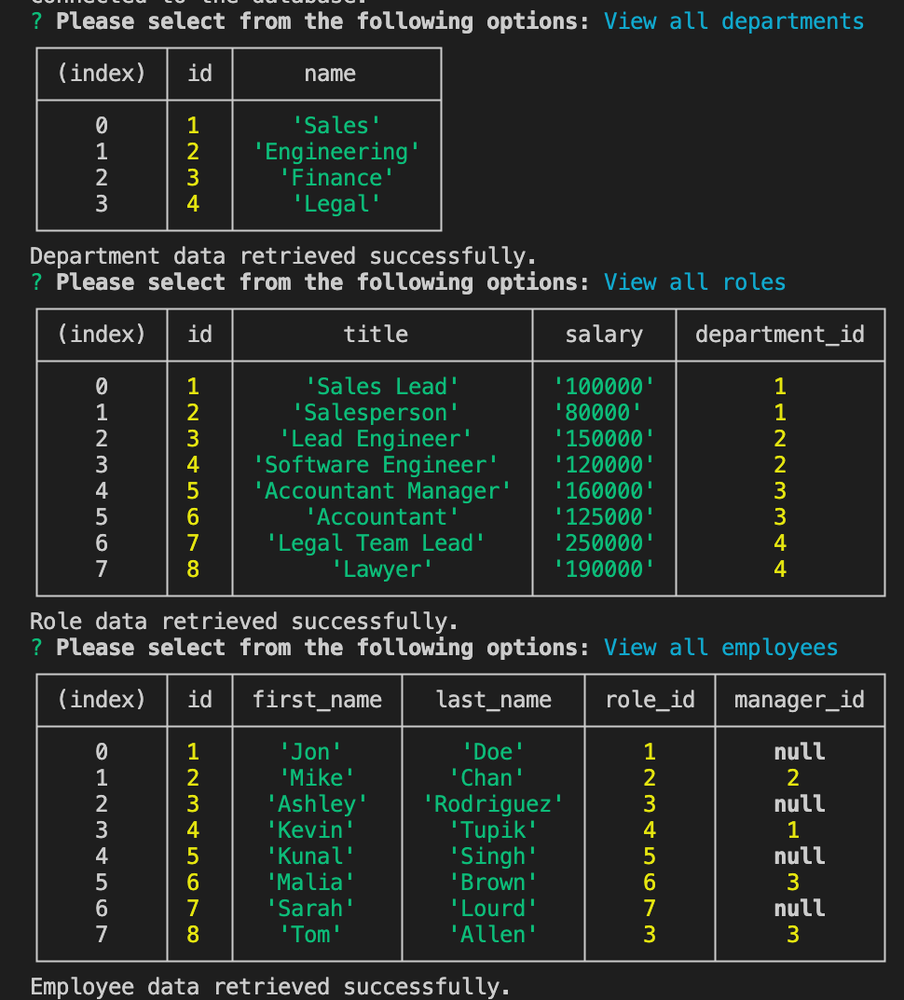

# sql-employee-tracker

## Description
---
This application is a database management system allowing companies to maintain and edit employee, department and roles. Using the terminal we are able to access database to see current roles, employees and departments. It also allows us to add roles, employees or departments. 

## Usage
---
When `node index.js` is ran in the terminal prompts appear in a menu form allowing user to chose through a verity of options 

## Installation
---
To install this project to get the development environment running:

1. Clone GitHub repository here: https://github.com/aHoff6/sql-employee-tracker
by clicking the green "code" button and copying the URL.

2. Open the Command Line and change the directory to where you would like to clone the directory.

3. Type the command "git clone" followed by the URL you copied earlier and press enter.

4. Run `npm install` to install dependencies.

5. Run `mysql -u root -p` then enter password. while in sql shell run `source db/seeds.sql`

6. Then run `node index.js` to begin.

## Reference picture
---

[Click here for a demo video](https://drive.google.com/file/d/1d3hEEZHzdVfwB3YtuDLFcQCWVjlqIxPW/view)

